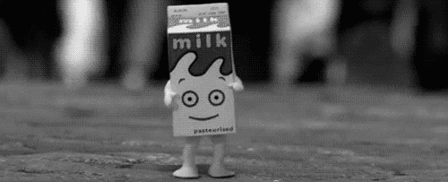

# Cartons

Hello, and welcome to Cartons! I will be using this project to store Rust implementations of ideas I've used in other languages. 

My friends have already heard me talk up Rust. Readers of my blog have too. Cartons will make it even easier as it grows and collects tangible artifacts useful for saying, "_here's what that idea looks like in Rust_".

